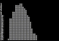

# Short Programs

Select the **Project Link** below to view each project's details, including the program code. You can either copy and paste these programs into your favorite Apple II emulator _or_ enter them into your actual Apple II by hand, then type `RUN` to execute the program.

Programs with the  badge will run perfectly fine on a 1MHz Apple II, but may take minutes or hours to execute. For these programs, I strongly recommend using an emulator at full speed or an accelerated Apple II.

| Project Link | Thumbnail | Description |
| --- | --- | --- |
| [City Scape](short-programs/city-scape.md) |  | Randomly generates a city skyline   |
| [Driving](short-programs/driving.md) |  | Driving game with obstacles   |
| [Fireworks](short-programs/fireworks.md) |  | Animated fireworks display   |
| [FizzBuzz](short-programs/fizzbuzz.md) |  | I AM SO SMART! S-M-R-T!   |
| [Floyd-Steinberg Plasma](short-programs/floyd-steinberg-plasma.md) |  | F-S dithered sine waves   |
| [Gumballs](short-programs/gumballs.md) |  | Draws 260 gumballs on the screen   |
| [Junk Drawer](short-programs/junk-drawer.md) |  | Draw things with chunky pixels   |
| [Random Plasma](short-programs/random-plasma.md) |  | Random dithered sine waves   |
| [Tessellator](short-programs/tessellator.md) |  | Tessellated patterns   |
| [Truchet Tiles](short-programs/truchet-tiles.md) |  | Crazy mazy looking thing-a-ma-bob   |
| [Typing Game](short-programs/typing-game.md) |  | Type letters and get a high score   |
| [Concentration](short-programs/concentration.md) |  | Card matching game   |
| [Desert Island](short-programs/desert-island.md) |  | Text adventure game   |
| [Fifteen Puzzle](short-programs/fifteen-puzzle.md) |  | Sliding tile puzzle   |
| [Geometric](short-programs/geometric.md) |  | Geometric pattern   |
| [GR-Kanoid](short-programs/gr-kanoid.md)  |  | 2019 Two-Liner Contest submission    |
| [Hello](short-programs/hello.md) |  | Handy Applesoft program loader   |
| [Identity Crisis](short-programs/identity-crisis.md) |  | Susan Kare's "Happy Mac" on an Apple II   |
| [Mind The Gaps](short-programs/mind-the-gaps.md)  |  | 2019 Two-Liner Contest winner    |
| [Sierpinski Triangle](short-programs/sierpinski.md) |  | Draws the fabled fabulous fractal   |
| [Snake Game](short-programs/snake-game.md) |  | Interactive snake game   |
| [Sprite](short-programs/sprite.md) |  | Draws Kirby on the screen   |
| [Stacker](short-programs/stacker.md) |  | Simple stacking game   |
| [SYS.DIAG](short-programs/sys-diag.md) |  | System diagnostic (not really)   |
| [Target Practice](short-programs/target-practice.md) |  | Artillery game   |
| [Tower of Hanoi](short-programs/tower-of-hanoi.md) |  | Interactive puzzle game   |
| [Color Plasma](short-programs/color-plasma.md) |  | F-S dithered perspective landscape   |

### Download The Disk Image
The following image contains the above programs in a single, easy-to-use package.
* [short-programs.dsk](short-programs/short-programs.dsk)   

### Tips & Tricks
If you're interested in writing your own one- and two-liners, I've compiled some [tips & tricks](tips-and-tricks.md) that you might find helpful.

# My Other Apple II Projects

## Game Boy Tetris for Apple II
I released an Apple II port of the Game Boy version of Tetris in late 2023. You can download the playable disk image and source code from one of the following locations.
* [MediaFire](https://www.mediafire.com/file/idnz38jba6kgsof/Game_Boy_Tetris_for_Apple_II_%2528src_incl%2529.zip/file) 
* [Apple Asimov](https://mirrors.apple2.org.za/ftp.apple.asimov.net/images/games/action/Game%20Boy%20Tetris%20for%20Apple%20II%20%28src%20incl%29.zip) 
* [Internet Archive](https://archive.org/details/gameboy_tetris_for_apple_ii)  detailed instructions in comments

## Conway II
A pretty fast implementation of Conway's Game of Life cellular automaton on the Apple II.
* [GitHub Project](https://github.com/thelbane/ConwayII) 

# Community
Thank you for being one of the like fourteen people who really digs this retro stuff. If you have any problems with the programs in this repo, please let me know by creating an issue. I'm also aware that my one- and two-liners are very hacky and difficult to parse out. If there's a particular program you'd like to understand better, but you've hit a roadblock, let me know and I'll try to make time to add detailed dev notes.
