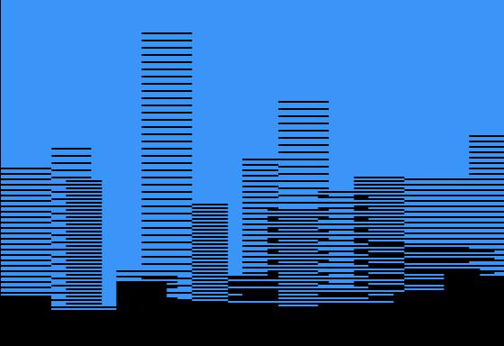

# City Scape

 

In the twilight embrace, a digital cityscape unfolds in hues of deepening blue. Here, buildings rise—a mosaic of shadow and light—where their edges blur and textures whisper secrets, merging in a dance that defies dimension. This skyline, rendered in the softness of dusk, invites the eye to wander, to squint and see a world suspended between the tangible and the imagined, where concrete jungles dream in blue.

## Program

`0HGR2:HCOLOR=6:HPLOT0,0:CALL62454:HCOLOR=4:FORN=0TO3:I=0:FORM=1TO1:J=I+INT(RND(1)*3)+2:J=J-((J>39)*(J-39)):T=INT(RND(1)*(4-N)*48)+N*48:FORX=ITOJ:FORY=TTO191STEP4-N:HPLOTX*7,YTOX*7+6,Y:I=J+1:M=J=39:NEXT:NEXT:NEXT:NEXT`

## Discussion

[Apple II Enthusiasts Group Permalink](https://www.facebook.com/groups/5251478676/permalink/10157310582478677/)
