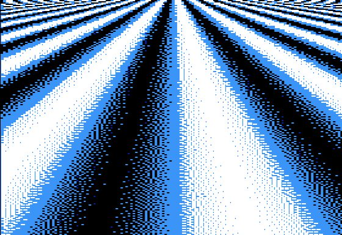

# Color Plasma



## Program

```applesoft
0 DIMA(2,281):HGR2:HCOLOR=7:REM "A" IS THE ERROR CORRECTION BUFFER
1 FORY=0TO191:T=1-T:FORX=0TO139
2 V=SIN((X-70)/(1+(Y/10)))+1:REM COMPUTE VALUE
3 V=V+A(T,X+1):REM ADD ERROR CORRECTION
4 Q=INT(V+0.5):REM QUANTIZE VALUE (0,1 OR 2)
5 E=V-Q:REM COMPUTE ERROR
6 A(T,X+1)=0:A(T,X+2)=A(T,X+2)+E*.4:A(1-T,X)=A(1-T,X)+E*.2:A(1-T,X+1)=A(1-T,X+1)+E*.3:A(1-T,X+2)=A(1-T,X+2)+E*.1:REM ERROR DIFFUSION TO NEIGHBORING PIXELS
7 IFQ>0THENHPLOTX*2,Y:REM PLOT LEFT PIXEL OF PAIR IF QUANTIZED VALUE IS NOT ZERO
8 IFQ>1THENHPLOTX*2+1,Y:REM PLOT RIGHT PIXEL IF QUANTIZED VALUE IS 2 (WHITE)
9 NEXT:NEXT
```

## Discussion

[Apple II Enthusiasts Group Permalink](https://www.facebook.com/groups/5251478676/permalink/10158230715378677/)
