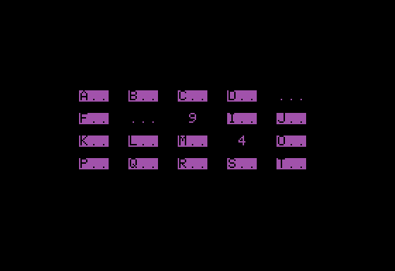

# Concentration

 

Concentration challenges your squishy human brain to remember where you last saw some single-digit numbers. Type a letter to reveal the number underneath. Find ten pairs of matching numbers to win the respect of your peers.

## Program

`0POKE184,22+(N=0)*101:GETA$:A=ABS(ASC(A$)-65):A=A-32*(A>31):A$=MID$(C$,A+1,1):R=INT(A/5):VTABR*2+9:HTAB9+5*(A-R*5):?" "A$" ":R=A$=B$ANDA<>B:RETURN:HOME:DIMG(20):FORN=0TO19:I=RND(1)*(N+1):C$=MID$(C$,1,I)+CHR$(48+N/2)+MID$(C$,I+1,N-I+1):NEXT`

`1FORW=0TO9:FORR=0TO1:FORD=0TO19:R=INT(D/5):POKE50,63+192*G(D):VTABR*2+9:HTAB9+5*(D-R*5):?MID$(CHR$(D+65)+"...",G(D)+1,3):NEXT:NORMAL:GOSUB0:B$=A$:B=A:GOSUB0:FORZ=0TO999:NEXT:M=M+1:NEXT:G(A)=1:G(B)=1:NEXT:VTAB18:?"YOU WON IN "M" MOVES!"`

## Discussion

[Apple II Enthusiasts Group Permalink](https://www.facebook.com/groups/5251478676/posts/10163542209533677/)
