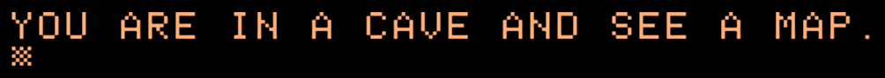

# Desert Island

 



Do ye dare seek the lost treasure? Arrrrrgh! Brave the high seas, scorching deserted islands, and countless other dangers!

Commands: 
* "E" - Move east
* "W" - Move west
* "T" - Take the item in the current location
* "D" - Dig

Try to find the treasure in as few moves as possible!

## Program

```
0FORN=0TO5:READR$(N),I$(N):NEXT:READW$,Q$:FORN=0TO1:I$=I$(R):C=C+1:DATA"IN A CAVE","A MAP","ON A SUNNY BEACH",,"IN THE OCEAN",,"TREADING WATER",,"ON A SMALL ISLAND",,"BY A PALM TREE","A SHOVEL","YOU FOUND THE TREASURE IN "," AND SEE "

1?"YOU ARE "R$(R)MID$(Q$+I$,1,30*(LEN(I$)>1))".":GETA$:?A$;:?MID$("AKEN.IG.",1+(A$="D")*5,((A$="T"ANDI$<>"")ORA$="D")*5):I$(R)=MID$(I$,1,LEN(I$)*(A$<>"T")):R=R+(A$="E"ANDR<5)-(A$="W"ANDR>0):N=R=4ANDA$+I$(0)+I$(5)="D":NEXT:?W$C" MOVES!"
```

## Discussion

[Apple II Enthusiasts Group Permalink](https://www.facebook.com/groups/5251478676/permalink/10158444047953677/)
