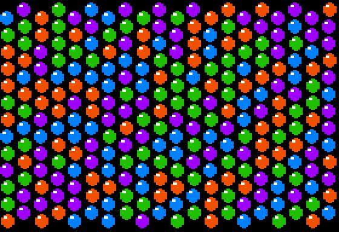

# Gumballs

Just a bunch of colorful gumballs. Don't try to chew more than 8 or 9 of these babies at the same time.

## Program

`0HGR2:DIMY(6):FORN=0TO5:READY(N):NEXT:FORA=0TO266STEP14:S=7-S:FORY=STO178STEP14:HCOLOR=INT(RND(1)*2)*4+3:X=A+INT(RND(1)*2):FORN=0TO5:HPLOTX+N*2,Y+Y(N)TOX+N*2,Y+15-Y(N):NEXT:HPLOTX+3,Y+4TOX+3,Y+5:NEXT:NEXT:DATA5,3,2,2,3,5`

## Discussion

[Apple II Enthusiasts Group Permalink](https://www.facebook.com/groups/5251478676/permalink/10157704431108677/)
