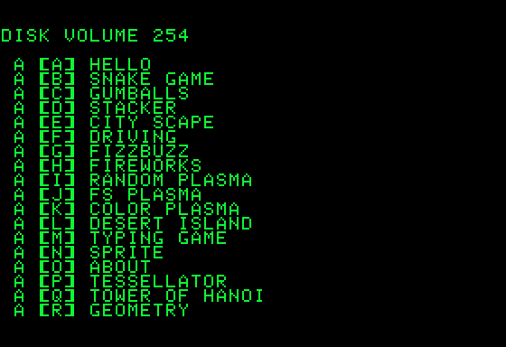

# Hello

 

A two-line _HELLO_ program that turns a DOS 3.3 disk CATALOG into a menu! Crazy!

## Program

`0TEXT:HOME:GOSUB1:X=3:FORY=0TO23:GOSUB1:R=Y+1:Y=Y+23*(A>47ANDA<58):NEXT:FORY=RTO23:GOSUB1:VTABY:?"["CHR$(65-R+Y)"]":Y=Y+23*(A=32):NEXT:FORN=0TO1:GETA$:A=ASC(A$):N=A>64ANDA<42-R+Y:NEXT:X=7:Y=A-56-R:Z=29:GOSUB1:?A$:NORMAL:VTAB24:?D$"RUN"A$`

`1POKE44452,99:D$=CHR$(4):VTAB1:?MID$(D$+"CATALOG",1,8-C*8):C=1:A$="":M=1024+X+(INT(Y/8)*40)+(Y/8-INT(Y/8))*1024:FORB=MTOM+Z-1:A=PEEK(B)-128:A$=A$+CHR$(A):NEXT:POKE50,255-192*(X=7):VTABY+1:HTABX+1:RETURN`

## Discussion

[Apple II Enthusiasts Group Permalink](https://www.facebook.com/groups/5251478676/permalink/10158434283573677/)
