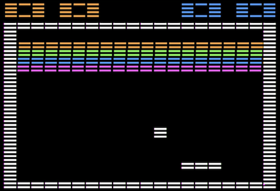

# Junk Drawer

 



This is a paint program that draws in big, chunky, delicious pixels.

Controls: I, J, K, M to move the cursor and 0-7 to change the color.

## Program

```
0HGR2:FORL=0TO1:HCOLOR=3:HPLOTA,B+2:HCOLOR=C:FORZ=BTOB+1:HPLOTA,ZTOA+11,Z:NEXT:GETK$:K=ASC(K$)-74:HCOLOR=0:HPLOTA,B+2:X=X+(K-1)*(ABS(K-1)=1):X=X-INT(X/20):A=X*14:Y=Y+K*(ABS(K)=1):Y=Y-INT(Y/48):B=Y*4:L=0:C=C+(K+26-C)*(INT((K+26)/8)=0):NEXT
```

## Discussion

[Apple II Software Enthusiasts Group Permalink](https://www.facebook.com/groups/418327412201896/posts/935604477140851/)
