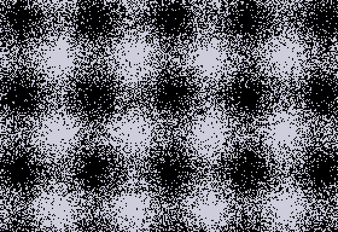

# Random Plasma

 

Lee Fastenau 
_Interference: A Study in Binary Simplicity_, 2019 
Digital Image, 1-bit color

At first glance, Lee Fastenau's "Interference: A Study in Binary Simplicity" may seem like an homage to the minimalist joys of early computing—where art was a game of black and white, and complexity was not a requirement for beauty. Born from Fastenau's self-proclaimed 'Monochromatic Musing' period, this piece invites viewers to find harmony in discord, order in chaos, and perhaps, a bit of irony in earnestness. Utilizing a technique that can only be described as 'meticulously haphazard,' Fastenau crafts an intricate dance of light and shadow through the random dithering of pixels, deliberately eschewing the precision of Floyd-Steinberg for the unpredictability of nature itself. From a distance, the image transforms into two sine waves caught in an eternal dance at a ninety-degree embrace—a testament to the artist's playful engagement with the viewer's perception. "Interference" is not just an exploration of digital simplicity; it's an invitation to ponder the complexities of the analog heart in a digital world, all while not taking itself too seriously.

## Program

`0HGR2:FORY=0TO191:FORX=0TO279:HCOLOR=(RND(1)>(SIN(Y*.1)+2+SIN(X*.1))/4)*3:HPLOTX,Y:NEXT:NEXT`
