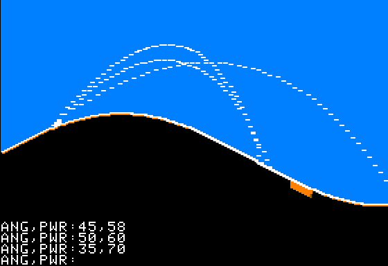

# Target Practice

 



Target Practice is a solitaire version of the classic artillery game. Hit the red target ten times using as few shots as possible. The angle (ANG) is the elevation of the shot in degrees, and power (PWR) is the speed of the shot in meters per second. There is a constant slight (1 m/s) head wind that you'll have to contend with as well.

## Program

```
0DIMY(140):POKE34,20:HOME:HCOLOR=7:FORU=7TO16:HGR:R=RND(1)*37:FORN=0TO139:T=INT(N/8)=U:Y(N)=149-R+COS(N*R*.001+R)*R:X=N*2:Y=Y(N):HPLOTX,0TOX+1,Y:HPLOTTOX+1,Y+5*T:NEXT:E=Y(20)-5:FORN=0TO4:HPLOT41-N,E+NTO41,E+N:NEXT:P=2000:FORQ=0TO1:P=P/2

1INPUT"ANG,PWR:";A,V:R=A*-.0175:C=COS(R)*V:D=SIN(R)*V:X=0:Y=0:FORT=0TO10STEP0.1:HPLOTX,Y:X=41+INT(C*T/2-T*T)*2:Y=E+D*T+9.8*T*T:I=X/2*(X>0ANDX<280):T=T+((Y>Y(I))+(X<0)+(X>279)+(Y<0))*15:NEXT:Q=INT(X/16)=U:NEXT:S=S+P:NEXT:?"SCORE:"INT(S)
```

### Human Readable
Thanks [Ted Thompson](https://github.com/TedThompson) for taking the time to reformat the listing. For fun, and to help anyone trying to decipher my code, I decided to attempt to describe what each line does here:

```
100 DIM Y(140): REM INITIALIZE THE ARRAY CONTAINING THE Y-COORDINATES OF THE GROUND
110 POKE 34,20: REM SET THE TOP OF THE TEXT WINDOW TO 20
120 HOME: REM CLEAR THE SCREEN
130 HCOLOR=7: REM SET THE HI-RES COLOR TO WHITE
140 FOR U=7 TO 16: REM SETUP OUTER LOOP THAT DRIVES THE 10 ROUNDS. U DRIVES THE TARGET POSITION.
150 HGR: REM SET AND CLEAR THE MIXED HI-RES GRAPHICS MODE
160 R=RND(1)*37: REM GET A RANDOM FLOATING POINT NUMBER BETWEEN 0 AND 37 TO DRIVE PHASE, FREQUENCY, AND AMPLITUDE OF THE ROLLING HILLS
170 FOR N=0 TO 139: REM LOOP TO DRAW THE PLAYFIELD
180 T=INT(N/8)=U: REM T=1 IF THE COLUMN BEING DRAWN CONTAINS THE TARGET, OTHERWISE T=0.
190 Y(N)=149-R+COS(N*R*.001+R)*R: REM COMPUTE THE Y-COORDINATE OF THE GROUND WHERE THE LOWEST POINT IS 149 AND THE HIGHEST POINT IS 149-R
200 X=N*2: REM COMPUTE THE X-COORDINATE OF THE COLUMN BEING DRAWN
210 Y=Y(N): REM FETCH THE Y-COORDINATE FROM THE ARRAY TO MAKE THE NEXT TWO LINES A LITTLE SHORTER
220 HPLOT X,0 TO X+1,Y: REM DRAW THE SKY. EVEN COLUMNS DRAWN WITH HCOLOR 7 ARE BLUE.
230 HPLOT TO X+1,Y+5*T: REM DRAW EITHER A SINGLE PIXEL (GROUND) OR A 5-PIXEL LINE (TARGET) AT THE ODD COLUMN WHERE THE SKY MEETS THE GROUND. THIS MAKES THE GROUND WHITE AND THE TARGET RED.
240 NEXT: REM END OF THE PLAYFIELD DRAWING LOOP
250 E=Y(20)-5: REM COMPUTE THE POSITION OF THE TOP OF THE PLAYER'S GUN TURRET
260 FOR N=0 TO 4: REM LOOP TO DRAW THE GUN TURRET
270 HPLOT 41-N,E+N TO 41,E+N: REM LOOKS LIKE WE'RE DRAWING A CRUDE TRIANGLE
280 NEXT: REM END OF THE TURRET DRAWING LOOP
290 P=2000: REM INITIALIZE THE MAXIMUM POINT VALUE OF THE CURRENT ROUND TIMES TWO (FOR HACKY REASONS)
300 FOR Q=0 TO 1: REM LOOP FOR FIRING SALVOS ENDS WHEN THE PLAYER HITS THE TARGET
310 P=P/2: REM DIVIDE THE POINTS BY 2. HIT ON FIRST SHOT GIVES 1000 POINTS. EACH MISS DIVIDES THE POSSIBLE POINTS BY 2.
320 INPUT "ANG,PWR:";A,V: REM GET USER INPUT. ANGLE IS IN DEGREES WITH 0 BEING LEVEL WITH THE GROUND AND 90 BEING PERPENDICULAR TO THE GROUND. POWER IS IN METERS PER SECOND.
340 R=A*-.0175: REM CONVERT DEGRESS TO RADIANS
350 C=COS(R)*V: REM COMPUTE THE HORIZONTAL VELOCITY OF THE SHOT
360 D=SIN(R)*V: REM COMPUTE THE VERTICAL VELOCITY OF THE SHOT
370 X=0: REM INITIALIZE SHOT X-COORDINATE TO TOP LEFT OF SCREEN (FOR HACKY REASONS)
380 Y=0: REM INITIALIZE SHOT Y-COORDINATE TO TOP LEFT OF SCREEN (FOR HACKY REASONS)
390 FOR T=0 TO 10 STEP 0.1: REM LOOP FOR COUNTING TIME IN SECONDS (NOT IN REALTIME)
400 HPLOT X,Y: REM PLOT THE SHOT
410 X=41+INT(C*T/2-T*T)*2: REM COMPUTE THE SHOT'S X-COORDINATE RELATIVE TO THE GUN TURRET FOR THE GIVEN TIME, ACCOUNTING FOR A 1 M/S HEADWIND
420 Y=E+D*T+9.8*T*T: REM COMPUTE THE SHOT'S Y-COORDINATE RELATIVE TO THE GUN TURRET FOR THE GIVEN TIME, ACCOUNTING FOR EARTH'S GRAVITY (9.8 M/S)
430 I=X/2*(X>0 AND X<280): REM I=0 IF THE SHOT'S POSITION IS BEYOND THE LEFT OR RIGHT BOUNDS OF THE PLAYFIELD, OTHERWISE IT IS THE INDEX FOR THE GROUND POSITION IN THE Y() ARRAY
440 T=T+((Y>Y(I))+(X<0)+(X>279)+(Y<0))*15: REM THIS GOBBLEDYGOOK JUST SETS T (TIME) TO EITHER ITSELF OR ITSELF PLUS 15 TO EXIT THE SHOT LOOP IF THE SHOT IS OUT OF BOUNDS OR HAS HIT THE GROUND
450 NEXT: REM END OF THE SHOT LOOP
460 Q=INT(X/16)=U: REM Q=1 IF THE TARGET WAS HIT, ENDING THE SALVO LOOP, OTHERWISE Q=0
470 NEXT: REM END OF THE SALVO LOOP
480 S=S+P: REM ADD THE POINTS FOR THE CURRENT ROUND TO THE SCORE
490 NEXT: REM END OF THE ROUNDS LOOP
500 PRINT "SCORE:";INT(S): REM DISPLAY THE FINAL SCORE
```

## Discussion

[Apple II Enthusiasts Group Permalink](https://www.facebook.com/groups/5251478676/permalink/10159354264563677/)
