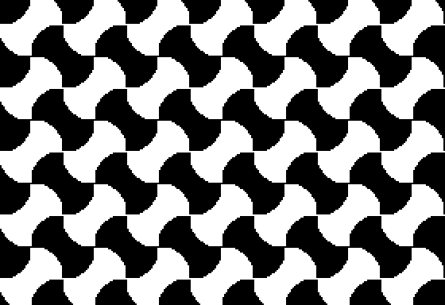

# Tessellator

Tessellated pattern generator.

| Parameter | Description |
|---|---|
| PERIOD | The size of the repeating pattern in pixels (2-292) |
| CO-EFFICIENT | Multiplier (higher is more chaotic, zero draws boring squares) |
| THRESHOLD | The break between black and white (-2 is pure white, +2 is pure black) |

Try inputting: 40,1,0

## Program

`0TEXT:INPUT"PERIOD,CO-EFFICIENT,THRESHOLD: ";P,N,T:M=6.28318/P:HGR2:FORY=0TOP-1:B=Y-95:FORX=0TOP-1:A=X-139:HCOLOR=3*(COS(A*M+SIN(B*M)*N)+COS(B*M+SIN(A*M)*N)>T):FORD=YTO191STEPP:FORC=XTO279STEPP:HPLOTC,D:NEXT:NEXT:NEXT:NEXT`

## Discussion

[Apple II Enthusiasts Group Permalink](https://www.facebook.com/groups/5251478676/permalink/10158481850618677/)
