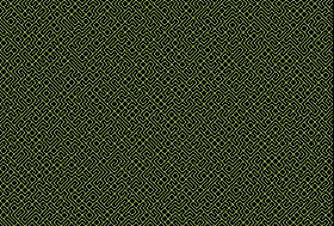

# Truchet Tiles

 

It's not a maze. It's a [Truchet tile](https://en.wikipedia.org/wiki/Truchet_tiles) pattern.

## Program

`0HGR2:HCOLOR=3:S=3:Y=0:FORL=0TO1:FORX=0TO280-SSTEPS:D=INT(RND(1)*2):Z=Y+D*(S-1):D=-D*2+1:FORR=0TOS-1:HPLOTX+R,Z:Z=Z+D:NEXT:NEXT:Y=Y+S:L=(Y+S)>191:NEXT`

## Discussion

[Apple II Enthusiasts Group Permalink](https://www.facebook.com/groups/5251478676/posts/10162989967278677/)
